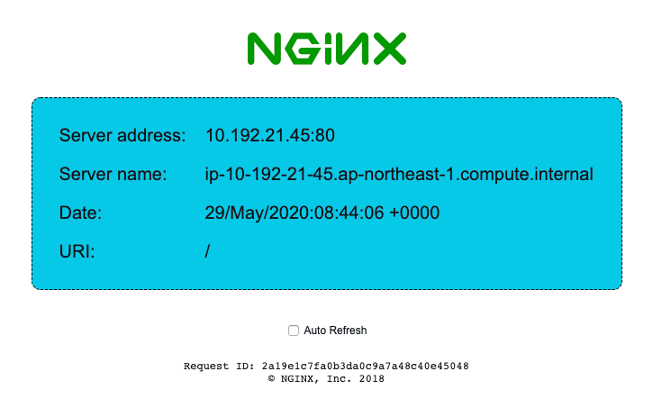
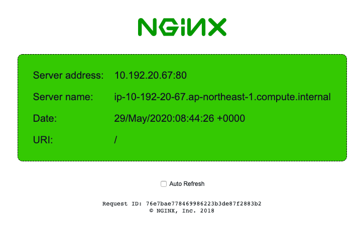

### README
This repository is a sample of B/G Deployment to AWS Fargate with terraform.

### Step0 Environment
The following versions have been tested
```
$ terraform -v
Terraform v0.12.16
+ provider.aws v2.64.0
+ provider.null v2.1.2
```

### Step1 Clone
```
$ git clone https://github.com/yuukiyo/ecsCodeDeploy.git
$ cd ecsCodeDeploy
```

### Step2 Blue Environment Deployment
```
$ terraform init
$ terraform apply --auto-approve
```

### Step3 Operation check
Get the DNS Name of alb.
```
$ aws elbv2 describe-load-balancers | jq .LoadBalancers[0].DNSName
"ecs-codedeploy-alb-1267343211.ap-northeast-1.elb.amazonaws.com"
```

Let's access it from your browser.
If the following screen appears, you have succeeded.


### Step4 Green Environment Deployment
```
$ git reset --hard origin/b/g-deploy
$ terraform apply --auto-approve
```

### Step5 Operation check
Let's access the same URL as in Step 3.
If the following screen appears, you have succeeded.

